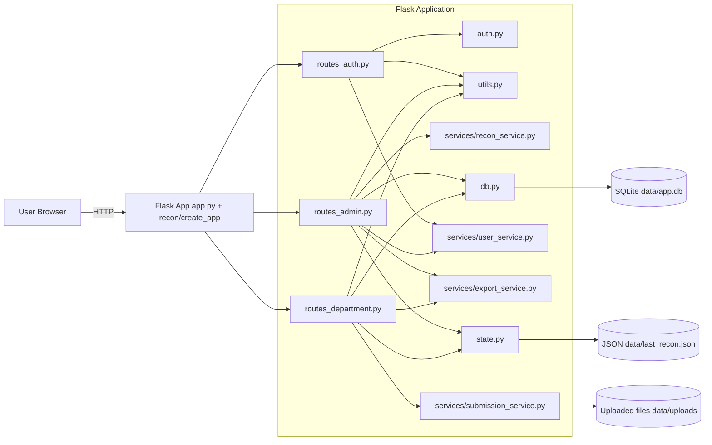
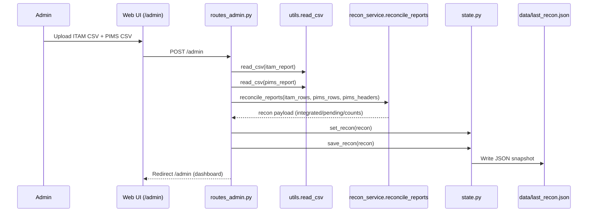
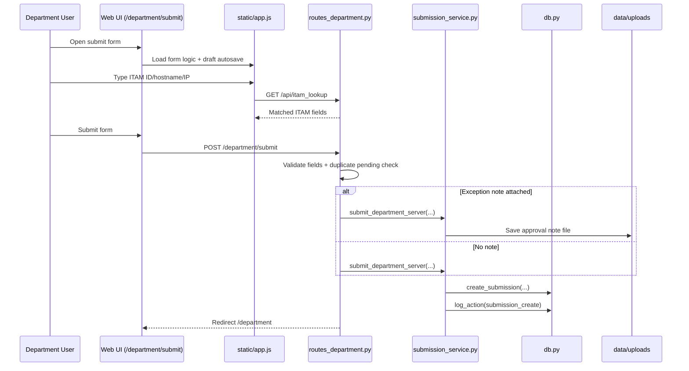
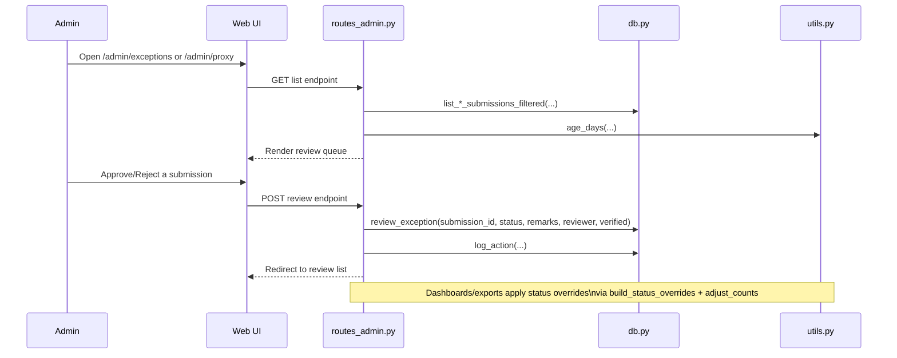

# Project Architecture And Roadmap

## 1) System Architecture

## 2) Core Sequence Flows

### 2.1 Admin Reconciliation Flow

### 2.2 Department Submission Flow

### 2.3 Admin Exception/Proxy Review Flow

## 3) Component Responsibilities

- `recon/routes_auth.py`
  - Login/logout/session routing.
  - Password change endpoint and password policy checks.
- `recon/routes_admin.py`
  - Reconciliation upload and dashboard.
  - User management, exception/proxy reviews, audit log, exports.
- `recon/routes_department.py`
  - Department dashboard, ITAM lookup, single/bulk submissions, template/export.
- `recon/db.py`
  - SQLite schema and all DB access operations.
  - Seeds default admin account.
- `recon/state.py`
  - In-memory + JSON persistence for last reconciliation result.
- `recon/utils.py`
  - CSV normalization, validation, filtering, status override logic, metrics/charts.
- `static/app.js`
  - Table UX, theme/sidebar state, form draft persistence, ITAM lookup, client validation.

## 4) Data Contracts

### 4.1 Required ITAM input fields

- `itam_id`
- `hostname`
- `region`
- `department`
- `environment`
- `ip_address`

### 4.2 Reconciliation status model

- Base result:
  - `Integrated` if ITAM IP exists in PIMS IP set.
  - `Pending` otherwise.
- Admin-reviewed submission overrides:
  - Approved exception -> `Exception`
  - Approved proxy integration -> `Integrated (Proxy)`

## 5) Prioritized Hardening Roadmap

## Phase 0 (Immediate - 1 to 2 days)

- Fix missing imports causing runtime breakage:
  - `recon/routes_auth.py`: import `change_password`.
  - `recon/routes_department.py`: import `UPLOADS_DIR`, `create_submission`, `log_action`.
- Add strict startup check for critical route dependencies.
- Add smoke test covering:
  - `/account/password` POST success path.
  - `/department/bulk-upload` success path.
  - `/uploads/<filename>` access path.

Acceptance criteria:
- No `NameError` in these routes.
- CI test run validates the three paths above.

## Phase 1 (Security Baseline - 2 to 4 days)

- Replace default credentials/secrets in deployment configs.
- Enforce CSRF protection for all POST forms.
- Restrict upload endpoint authorization:
  - Ensure users can only download files tied to submissions they are allowed to view.
- File validation hardening:
  - Validate extension + content type + size.
  - Reject unsafe names and unknown file types.

Acceptance criteria:
- Security review checklist passes for auth/session/form/file endpoints.
- Attempted unauthorized file downloads are denied.

## Phase 2 (Data Integrity + Scale - 3 to 5 days)

- Add DB indexes:
  - `submissions(department, admin_status, submitted_at)`
  - `submissions(hostname, ip_address, admin_status)`
  - `users(username)`
- Add migration discipline (Alembic or internal migration table).
- Add server-side pagination options for large submission lists.
- Add schema constraints for controlled values (`submission_type`, `admin_status`).

Acceptance criteria:
- Query latency remains stable with larger datasets.
- Schema changes are versioned and repeatable.

## Phase 3 (Quality + Operations - 3 to 6 days)

- Expand automated tests:
  - Admin reconciliation happy path and error path.
  - Exception/proxy review approval and rejection.
  - Export correctness with status overrides.
- Add CI workflow:
  - `pytest`, lint, and basic security checks.
- Improve observability:
  - Structured logs with request IDs.
  - Optional health endpoint and startup diagnostics.

Acceptance criteria:
- CI gates merges.
- Audit-critical flows are covered by tests.
- Runtime issues are diagnosable from logs.

## 6) Recommended Execution Order

1. Phase 0 fixes and smoke tests.
2. Phase 1 security baseline.
3. Phase 2 data/scale improvements.
4. Phase 3 quality and ops maturity.

## 7) Current Known Risks

- Runtime import gaps can break key flows.
- Download endpoint authorization is permissive unless constrained in route logic.
- Default credentials in config templates are unsafe for production.
- Test suite does not yet cover most admin and submission workflows.
